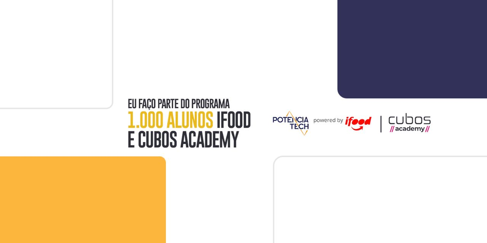

  

## 🖥️ Projeto
Esse é um projeto Repositório correspondente ao Exercício 01 da Ifood e Cubos Academy tendo como objetivo:
- Criar um repositório
- Clonar o repositório
- Criar um arquivo JS que imprima "Hello World"
- Executar o arquivo no terminal utilizando o node
- Fazer um commit
- Fazer um push no commit
- Editar o README.md

## 🚀 Tecnologias
Esse projeto foi desenvolvido durante o Programa Potência Tech da Ifood e Cubos Academy :
- JavaScript
- NodeJS
- Git e Github
